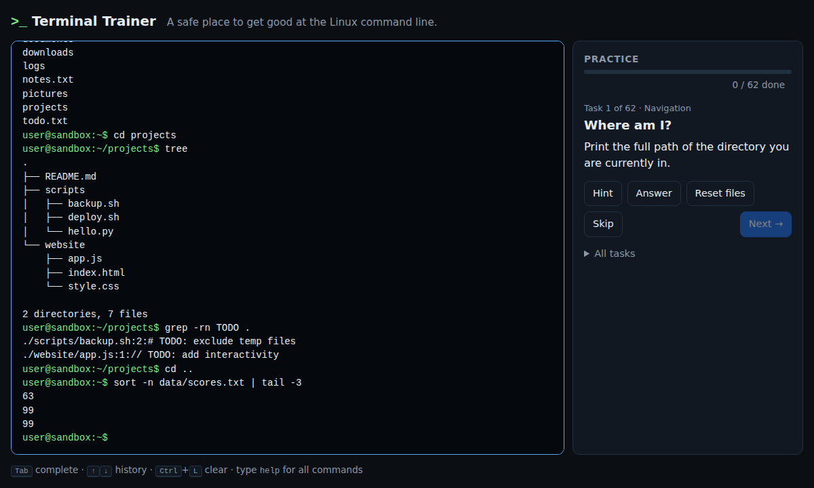

# Terminal Trainer

Get good at the Linux command line in a safe, simulated terminal with guided exercises. Nothing touches a real computer: the filesystem, the shell and every command are simulated, so you can `rm -rf` to your heart's content.

It comes in two flavours that share one engine:

| | Desktop web app | iOS / Android app |
| --- | --- | --- |
| Where | `apps/web` | `apps/mobile` |
| Run locally | `npm run dev` | `npm run dev:mobile` (browser) or `npm run mobile:ios` / `npm run mobile:android` |
| Interface | terminal beside a task panel | tabs: Practice, Tasks, Learn; key bar and suggestions above the phone keyboard |
| Deploy | any static host, GitHub Pages | App Store, Google Play (see [apps/mobile/README.md](apps/mobile/README.md)) |



## What you get

- **A realistic shell.** Pipes (`|`), redirects (`>`, `>>`, `<`), `&&` / `||` / `;`, quotes, `$VARIABLES`, `~`, wildcards (`*.txt`), Tab completion, history, `Ctrl+L`, `Ctrl+C`.
- **40 commands** with real error messages and `man` pages: `ls cd pwd tree cat touch mkdir rm rmdir cp mv chmod echo head tail wc grep sort uniq cut tr sed awk find which xargs whoami hostname uname date history clear env printenv export unset true false help man`.
- **62 exercises** across navigation, files, viewing, searching, pipes, permissions and environment, checked automatically after every command. Progress is saved on the device.
- **Zero runtime dependencies** in the web app; the mobile app adds only Capacitor.

## Quick start

You need [Node.js](https://nodejs.org/) 20 or newer.

```bash
npm install
npm run dev            # desktop app  → http://localhost:5173
npm run dev:mobile     # mobile app in a browser (use the device toolbar)
npm test               # every test in every package
npm run build          # type-check and build both apps
```

## How it is organised

```
packages/
  core/     the simulated shell, 40 commands, the trainer and 62 exercises (pure TypeScript, no DOM)
  ui/       the terminal widget (output log + input line) shared by both apps
apps/
  web/      desktop web app: page, task panel, styles
  mobile/   iOS/Android app (Capacitor): screens, key bar, native projects
```

Layers only point downwards: apps use `ui` and `core`; `ui` uses `core`; `core` uses nothing. Each workspace has its own tests (`tests/` next to `src/`) and `npm test` at the root runs them all. Because the apps share the engine, a new command or exercise added to `packages/core` appears in both.

Each package has a README-level comment at the top of its main files; start with `packages/core/src/index.ts` to see the public API.

## Add a command

Add an object to the right file in `packages/core/src/core/commands/` (or a new file listed in `commands/index.ts`), test-first in `packages/core/tests/core/commands/`:

```ts
export const rev: Command = {
  name: "rev",
  category: "Text",
  summary: "reverse each line",
  usage: "rev [file...]",
  details: "Prints each line of FILE (or stdin) backwards.",
  run: (ctx) => readInputs("rev", ctx, ctx.args, (text) =>
    joinLines(splitLines(text).map((line) => [...line].reverse().join(""))),
  ),
};
```

`help`, `man`, Tab completion, the mobile Learn tab and the suggestion chips all pick it up automatically.

## Add an exercise

Append an object to `packages/core/src/trainer/challenges.ts`:

```ts
{
  id: "files-rev",              // unique and permanent (progress is stored by id)
  topic: "Files",
  title: "Backwards",
  task: "Print notes.txt with every line reversed.",
  hint: "There is a command called rev.",
  solution: ["rev notes.txt"],  // the test suite runs this to prove the check works
  check: ({ result }) => result.stdout.startsWith("daerb"),
}
```

`check` runs after every command and receives the shell (files, current directory, variables), the line typed, and what it printed. An optional `setup(shell)` prepares files before the task starts. Every task begins from a fresh copy of the sample filesystem.

## Deploy the web app

`npm run build:web` writes a static site to `apps/web/dist/`; upload it anywhere. The GitHub Actions workflow tests every push, builds a debug Android APK and an iOS simulator build, and on pushes to `main` publishes the desktop app to GitHub Pages at `/` with the mobile web app at `/mobile/`. One-time setup: *Settings → Pages → Source: GitHub Actions*.

## Keyboard shortcuts (desktop)

| Key | Action |
| --- | --- |
| `Tab` | complete a command or path (press again to list options) |
| `↑` / `↓` | walk through history |
| `Ctrl+L` | clear the screen (same as `clear`) |
| `Ctrl+C` | cancel the line you are typing |
| `Ctrl+U` | erase the line you are typing |

On a phone the same actions are on the key bar above the keyboard.
