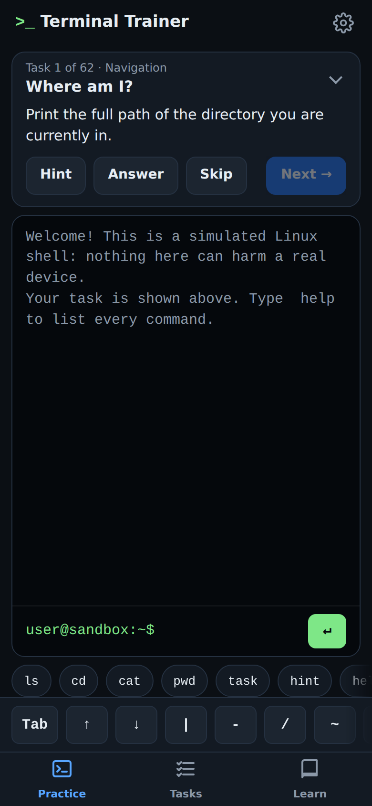
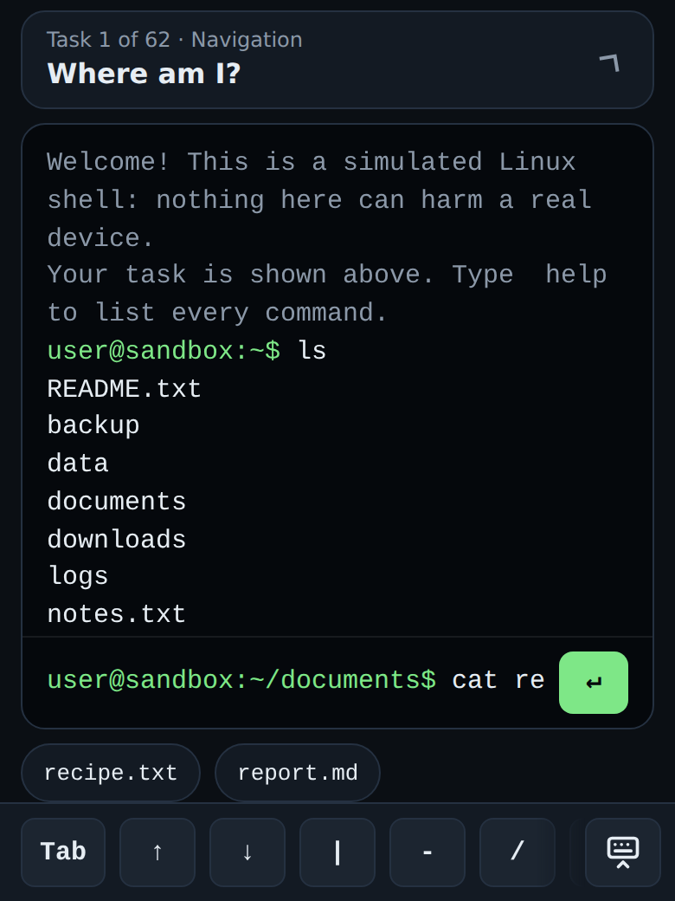
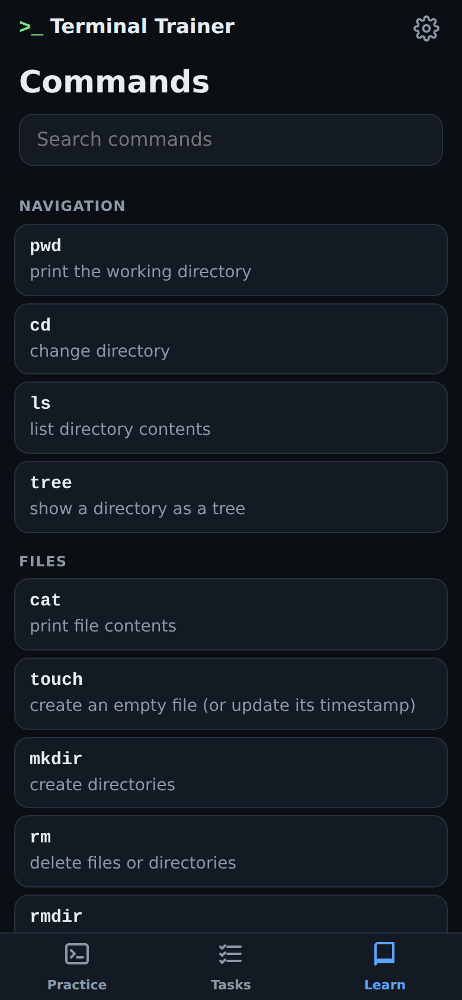

# Terminal Trainer — mobile app

The iOS and Android version of Terminal Trainer. It is the same simulated shell and the same 62 exercises as the desktop app, with a touch-first interface: a collapsible task card, a key bar for the characters phone keyboards hide (`|`, `-`, `/`, `~`, `*`, `>`, `$`), tap-to-insert suggestions, and a searchable command reference.

<p>
  
  
  
</p>

The app is built with [Capacitor](https://capacitorjs.com): the UI is TypeScript in `src/`, and `ios/` and `android/` are real Xcode and Android Studio projects that wrap it. Nothing in the app talks to a network.

## Try it in a browser

```bash
npm run dev:mobile          # from the repository root
```

Open the URL it prints, then use your browser's device toolbar (phone size) for the intended layout. This is the fastest way to iterate: every screen, the key bar and the suggestion chips work in a normal browser. Haptics and the native keyboard behaviour only exist on a device.

The same build is published at `/mobile/` on the GitHub Pages site, so you can open it on a real phone without installing anything.

## Run on a device or simulator

Prerequisites, once:

- **iOS:** a Mac with Xcode 16 or newer (App Store). Run `xcode-select --install` if you have never built from the terminal.
- **Android:** [Android Studio](https://developer.android.com/studio) with an SDK platform (35 or newer) and an emulator or a phone in developer mode.

Then, from the repository root:

```bash
npm run mobile:sync         # build the web app and copy it into ios/ and android/
npm run mobile:ios          # open the Xcode project, press Run
npm run mobile:android      # open Android Studio, press Run
```

Or without opening an IDE: `npm run run:ios -w apps/mobile` / `npm run run:android -w apps/mobile` build and launch on a connected device or a simulator.

Re-run `npm run mobile:sync` after any change to `src/`. The native projects never need editing for UI changes.

## Tests

```bash
npm test -w apps/mobile
```

Screens and components are tested with jsdom: tabs, key bar, suggestions, task card, each screen, settings, and an integration test of the whole app (solving a task buzzes and toasts, the back button, keyboard state, persistence). Shell and exercise logic are tested in `packages/core`.

CI (`.github/workflows/ci.yml`) additionally compiles the Android project into a debug APK (downloadable from the workflow run's artifacts) and builds the iOS project for the simulator on every push.

## Publish to the App Store and Google Play

1. **Choose your app id.** `com.terminaltrainer.app` is a placeholder. Pick your own reverse-DNS id and set it in three places: `capacitor.config.ts` (`appId`), `android/app/build.gradle` (`applicationId` and `namespace`) plus `android/app/src/main/res/values/strings.xml`, and the iOS target's *Bundle Identifier* in Xcode (Signing & Capabilities).
2. **Version numbers.** iOS: *Version* and *Build* on the target's General tab (`MARKETING_VERSION` / `CURRENT_PROJECT_VERSION`). Android: `versionName` and `versionCode` in `android/app/build.gradle`. Bump both for every store submission.
3. **Icons and splash screens** are generated from the images in `resources/` (`icon-only.png`, `icon-foreground.png`, `icon-background.png`, `splash.png`, `splash-dark.png`). To change them, replace those files and run `npm run assets -w apps/mobile`.
4. **iOS:** join the Apple Developer Program, open the project (`npm run mobile:ios`), select your team under *Signing & Capabilities*, then *Product → Archive* and *Distribute App* to upload to App Store Connect. Test through TestFlight before submitting for review.
5. **Android:** create an upload keystore (`keytool -genkey ...`), add a `signingConfigs.release` block to `android/app/build.gradle`, then build an App Bundle with `./gradlew bundleRelease` inside `android/` and upload `app/build/outputs/bundle/release/app-release.aab` in the Play Console.
6. **Privacy declarations.** The app collects no data, sends nothing over the network, and stores progress only on the device. Declare "Data Not Collected" in App Store Connect and "No data collected" in Play Console's Data safety form.
7. **Store listing.** Take screenshots in the iOS Simulator (6.7" and 6.1" iPhones) and an Android emulator. Suggested description: *Get good at the Linux command line on your phone. A safe, simulated terminal with 62 guided exercises covering navigation, files, pipes, grep, permissions and more. No account, no ads, works offline.*

## How the app is organised

```
src/
  main.ts                entry point: styles, storage guard, native bridge, app
  app.ts                 assembles screens, tabs and settings; cross-screen glue
  native.ts              the only file that imports Capacitor plugins (with a no-op fallback)
  preferences.ts         font size and card state, persisted
  components/
    tabs.ts              bottom tab bar, one panel visible at a time
    keybar.ts            on-screen shell keys + hide-keyboard button
    suggestions.ts       tap-to-insert chips built on Tab completion
    task-card.ts         the current exercise, collapsible
    toast.ts             brief "Solved!" message
  screens/
    practice.ts          task card + terminal + suggestions + key bar; runs commands
    tasks.ts             progress and the exercise list
    learn.ts             searchable command reference
    settings.ts          bottom sheet: text size, reset progress, about
  styles/app.css         tokens, layout, components
tests/                   jsdom tests, one file per component or screen
public/                  web manifest and icons for the browser version
resources/               source images for native icons and splash screens
capacitor.config.ts      app id, name, keyboard and status bar settings
ios/, android/           native projects (generated by Capacitor, committed)
```

The keyboard is the heart of the mobile design. While it is open, the app bar and tab bar hide, the task card collapses to its title, and a "hide keyboard" key appears, so the terminal keeps as much of the screen as possible. Key-bar and suggestion taps never steal focus from the input, so the keyboard stays up while you build a command.
